---
## Front matter
title: "Лабораторная работа No2. Система
контроля версий Git"
subtitle: "Архитектура ЭВМ"
author: "Новиков Константин Львович"

## Generic otions
lang: ru-RU
toc-title: "Содержание"

## Bibliography
bibliography: bib/cite.bib
csl: pandoc/csl/gost-r-7-0-5-2008-numeric.csl

## Pdf output format
toc: true # Table of contents
toc-depth: 2
lof: true # List of figures
lot: true # List of tables
fontsize: 12pt
linestretch: 1.5
papersize: a4
documentclass: scrreprt
## I18n polyglossia
polyglossia-lang:
  name: russian
  options:
	- spelling=modern
	- babelshorthands=true
polyglossia-otherlangs:
  name: english
## I18n babel
babel-lang: russian
babel-otherlangs: english
## Fonts
mainfont: PT Serif
romanfont: PT Serif
sansfont: PT Sans
monofont: PT Mono
mainfontoptions: Ligatures=TeX
romanfontoptions: Ligatures=TeX
sansfontoptions: Ligatures=TeX,Scale=MatchLowercase
monofontoptions: Scale=MatchLowercase,Scale=0.9
## Biblatex
biblatex: true
biblio-style: "gost-numeric"
biblatexoptions:
  - parentracker=true
  - backend=biber
  - hyperref=auto
  - language=auto
  - autolang=other*
  - citestyle=gost-numeric
## Pandoc-crossref LaTeX customization
figureTitle: "Рис."
tableTitle: "Таблица"
listingTitle: "Листинг"
lofTitle: "Список иллюстраций"
lotTitle: "Список таблиц"
lolTitle: "Листинги"
## Misc options
indent: true
header-includes:
  - \usepackage{indentfirst}
  - \usepackage{float} # keep figures where there are in the text
  - \floatplacement{figure}{H} # keep figures where there are in the text
---

# Цель работы

Целью работы является изучить идеологию и применение средств контроля
версий. Приобрести практические навыки по работе с системой git.

# Задание

1. Создайте отчет по выполнению лабораторной работы в соответствующем
каталоге рабочего пространства (labs>lab03>report).
2. Скопируйте отчеты по выполнению предыдущих лабораторных работ в
соответствующие каталоги созданного рабочего пространства.
3. Загрузите файлы на github.

# Выполнение лабораторной работы

1. Сделаем предварительную конфигурацию git, ввожу комманды указав имя и email владельца репозитория.

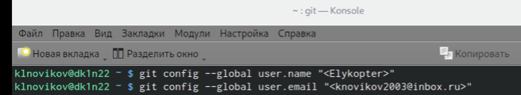{ #fig:001 width=90% }

2. Настроиваю utf-8 в выводе сообщений git, задаю имя начальной ветки, параметр autocrlf и параметр safecrlf.

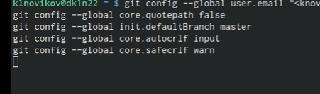{ #fig:002 width=90% }

3. Сгенерировал SSH ключ в своей учётной записи на github.

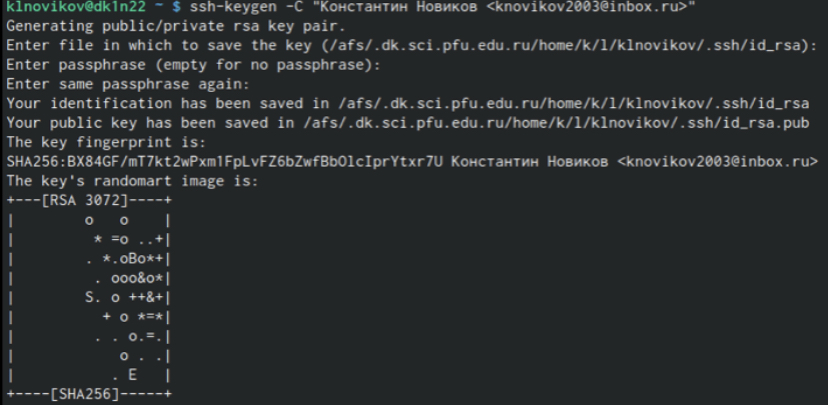{ #fig:003 width=90% }

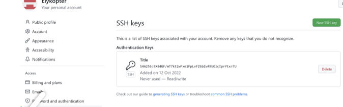{ #fig:004 width=90% }

4. Перешёл на станицу репозитория с шаблоном курс и, задав ему имя, создал его.

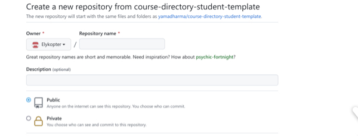{ #fig:005 width=90% }

5. Создав каталог для предмета «Архитектура компьютера», перешёл в него.

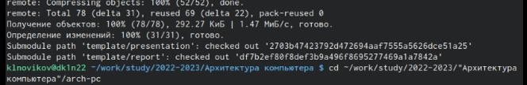{ #fig:006 width=90% }

6. Далее клонировал в него созданный репозиторий.

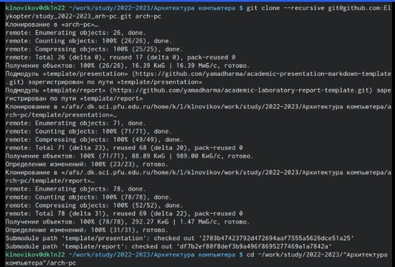{ #fig:007 width=90% }

7. Перешёл в каталог курса, удалил лишние файлы и создал нужные каталоги.

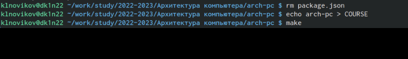{ #fig:008 width=90% }

8. В заключении отправил файлы на сервер.

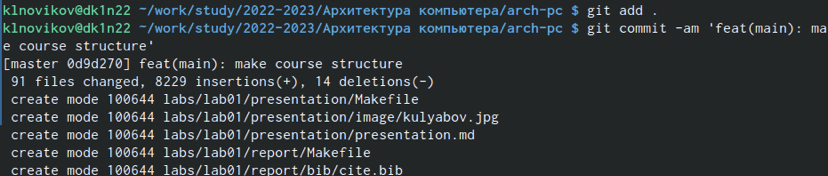{ #fig:009 width=90% }

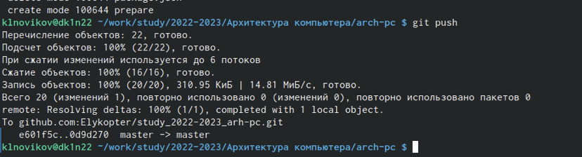{ #fig:010 width=90% }

9. Проверил правильность проделанной процедуры.

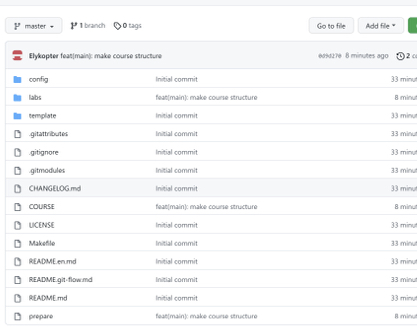{ #fig:011 width=90% }

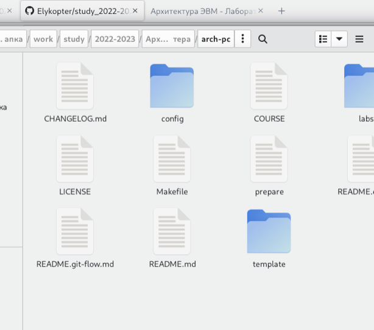{ #fig:012 width=90% }

# Выводы

Изучил особенности практической работы с системой гитхаба, применения средств контроля версий.

# Список литературы{.unnumbered}

::: {#refs}
:::
